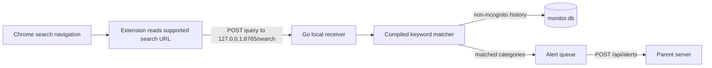

# Parental Monitor CLI

A local Go application that receives submitted search queries from a Chrome extension, checks them against configurable keyword groups, records eligible searches locally, and sends matching alerts to a parent-side HTTP API.

## How It Works



The extension detects a search only after a supported search engine commits a top-level navigation. It works for typed or pasted text because it reads the submitted query from the resulting URL. It does not read the clipboard or general page text. Supported sites are Google, Bing, DuckDuckGo, Yahoo, and YouTube; see the extension manifest and service worker for exact host/query rules.

The Go app listens only on `127.0.0.1:8765`. Normal, non-incognito searches are stored locally in `monitor.db`. Incognito searches are not saved as ordinary search history, but matching alerts are still evaluated and sent. Alert payloads include the full matching query, category, matched term, and timestamp.

## Requirements

- Go toolchain compatible with the version in `go.mod`.
- A C compiler/toolchain if your platform needs one for the SQLite driver (`github.com/mattn/go-sqlite3`).
- Google Chrome or a compatible Chromium browser.
- A parent server that accepts `POST <server_url>/api/alerts` with the `X-API-Key` header.

## Quick Start: Windows

Open PowerShell in the repository root (`D:\Project\parental-monitor-cli`). For a local end-to-end test, use two PowerShell windows.

1. Start the included development receiver:

   ```powershell
   go run .\testserver\test_server.go
   ```

   It listens on `http://localhost:8080` and prints received POST bodies. It is a test utility, not a production parent server.

2. Start the monitor in a second window:

   ```powershell
   go run . -config .\config.json
   ```

   Look for `Browser search receiver listening address=127.0.0.1:8765`.

3. Load the extension once: open `chrome://extensions`, enable **Developer mode**, choose **Load unpacked**, and select the repository's `extension` folder. Reload the extension from this page after changing its files.

4. In Chrome, search for a configured term, for example `wwe drugs beaten`, then press Enter. The extension badge should show `OK`; the monitor logs should show received search and keyword alerts; the test-server window should print the alert payload.

5. To test Incognito, open the extension's Details page and enable **Allow in Incognito**. Chrome requires this permission explicitly. Then open a new Incognito window and submit another test query.

To stop the foreground monitor, press **Ctrl+C**. The receiver status page is `http://127.0.0.1:8765/`; `/search` is an extension API endpoint, not a page to open directly.

## Configuration

`config.json` is loaded at startup. Restart the app after changing it.

| Field | Meaning |
| --- | --- |
| `server_url` | Parent API base URL. The client appends `/api/alerts`. For local testing, this is `http://localhost:8080`. |
| `api_key` | Sent to the parent API as `X-API-Key`; it is not copied into the Chrome extension. |
| `device_name` | Included in locally stored search events. |
| `scan_keywords` | Legacy/simple terms; terms not already in a group become their own category. |
| `scan_keyword_groups` | Default category-to-term lists. Each category can match at most once per query. |
| `custom_keywords` | Additional simple terms, merged with `scan_keywords`. |
| `custom_keyword_groups` | Parent-defined categories/terms, merged with default groups. Duplicate terms are ignored case-insensitively within a category. |
| `log_level` | `debug`, `info`, `warn`, or `error`. Defaults to `info`. |
| `monitor_interval_ms`, `batch_size`, `flush_interval_sec` | Retained legacy settings. The extension-driven search receiver does not use the polling interval or search batch size; alerts are sent when queued and retried by the flusher. |

Example custom additions:

```json
"custom_keywords": ["family-specific phrase"],
"custom_keyword_groups": {
  "school_rules": ["custom phrase", "another phrase"]
}
```

The analyzer normalizes case, matches complete words or consecutive word phrases, and returns one match per category. It does not infer synonyms: add each desired synonym explicitly. Broad terms can produce false positives, so test and tune the lists for your family.

## Tests And Performance

Run the package tests from the repository root:

```powershell
go test -vet=off ./...
```

`-vet=off` avoids the existing vet warning in `testserver/test_server.go`; tests still run normally.

Run the analyzer benchmark at 10,000, 100,000, and 1,000,000 terms:

```powershell
go test -run '^$' -bench BenchmarkFindMatchesLargeDictionary -benchmem ./internal/monitor
```

The analyzer compiles an Aho-Corasick-style token trie once during startup. Query matching traverses the query tokens and emits actual matches rather than checking every configured term. Index construction time and memory still grow with dictionary size; the benchmark measures lookup after construction.

## Build And Run

Build for the current OS:

```powershell
New-Item -ItemType Directory -Force .\build | Out-Null
go build -o .\build\parental-monitor.exe .
.\build\parental-monitor.exe -config .\config.json
```

The source also contains `Makefile` targets for platform builds and `build.sh` for cross-platform builds. Windows users can use `go build` directly as above.

Daemon mode is for a built executable, not the `go run` development flow:

```powershell
.\build\parental-monitor.exe -config .\config.json -daemon
.\build\parental-monitor.exe -stop
```

The daemon writes `daemon.log` and `monitor.pid` in its working directory. Foreground app logs are printed and appended to `monitor.log`.

## Repository Map

### Application and configuration

- `main.go` loads config, opens SQLite, compiles the matcher, starts the local HTTP receiver, wires search/alert callbacks, and shuts down gracefully.
- `config.json` contains server settings and default/custom keyword lists.
- `go.mod`, `go.sum` declare and lock Go dependencies.
- `daemon_windows.go`, `daemon_unix.go` detach and stop the app on their respective OSes.
- `Makefile`, `build.sh` provide build, test, formatting, and cross-build commands.

### Runtime packages

- `internal/searchreceiver/handler.go` handles extension submissions at `POST /search`; `GET /` is a local status response. It validates request shape and invokes the search and alert callbacks.
- `internal/monitor/analyzer.go` merges categories, compiles the token trie/failure links, and finds all matching categories efficiently.
- `internal/monitor/monitor.go` defines search/alert data types and retains the earlier keystroke-driven monitor implementation. `main.go` currently does **not** start that monitor; active browser capture is through the extension and `searchreceiver`.
- `internal/monitor/keystroke*.go`, `window*.go` support that older polling implementation and are not used by the active `main.go` flow.
- `internal/network/client.go` queues alerts and posts them to `<server_url>/api/alerts` with the API key.
- `internal/storage/storage.go` creates `monitor.db` tables and stores non-incognito search history and alert queries.
- `internal/log/logger.go` writes structured console lines and appends them to `monitor.log`.
- `testserver/test_server.go` is a simple local development server that prints incoming POST JSON.

### Chrome extension

- `extension/manifest.json` declares the Manifest V3 extension, navigation permissions, and supported host permissions.
- `extension/service-worker.js` detects committed top-level search URLs, extracts the query, notes whether the tab is Incognito, and posts it to the local receiver.
- `extension/popup.html` explains the extension status and Incognito permission.
- `extension/README.md` has extension-specific loading instructions.

### Generated/local files

`monitor.db`, `monitor.log`, `daemon.log`, and `monitor.pid` are runtime data, not source code. `scriptToUpdateTabs.txt` is a local PowerShell utility for reindenting `Makefile`; it is not part of app startup.

## Privacy And Scope

The extension has access only to its declared search-engine hosts and the local receiver. It reports committed search queries, not every keystroke or clipboard item. Benign searches remain local; matching alert events, including the full query, are sent to the configured parent API. Chrome disables extension access in Incognito until the user explicitly enables it.
